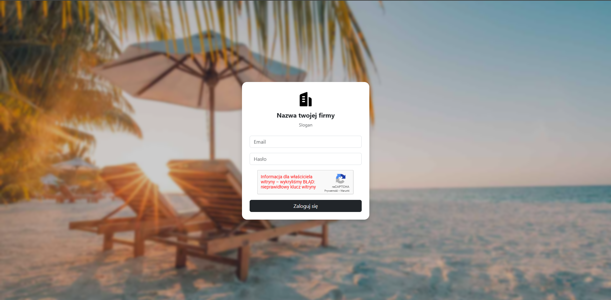

# 🗓️ Employee Leave Management System

A web-based ERP system for managing employee leave requests. It allows employees to submit leave applications, managers to approve or reject them, and includes an admin panel for user management with role-based access control.

## Table of Contents

- [Description](#description)
- [Features](#features)
- [Technologies](#technologies)
- [Installation](#installation)
- [Screenshots](#screenshots)
- [Project Insights](#project-insights)
- [License](#license)

## Description

This project addresses the problem of manual leave tracking by introducing an efficient request and approval system with user role levels. It helps organizations manage leave processes in a more structured and digital way.

## Features

- User authentication and login
- Leave request submission by employees
- Approval or rejection of requests by supervisors
- Admin panel for managing users and leave requests
- Session handling and user authorization
- Database operations using PDO (prepared statements)

## Technologies

- PHP 8.2
- MySQL
- Bootstrap 5
- HTML5 & CSS3
- JavaScript
- PDO (PHP Data Objects)

## Installation

1. Clone the repository:
   ```bash
   git clone https://github.com/your-username/leave-management.git
2. Copy the .env.example file to .env and configure your database credentials:
    ```bash
    DB_HOST=localhost
    DB_NAME=erp_leave
    DB_USER=root
    DB_PASS=
3. Install Composer dependencies:
    ```bash
    cd ERP-Leave-Management
    composer install
4. Import the database schema from docs/db-leave-management.sql.
5. Configure your local server (e.g., MAMP, XAMPP) and access the app at: http://localhost/erp-leave-management

## Screenshots



## Project Insights

During the development of this application, I improved the following skills:
- Structuring PHP code in an organized, modular way
- Securely interacting with the database using PDO
- Building responsive user interfaces with Bootstrap
- Managing sessions, authentication, and access control levels

## License

This project is licensed under the MIT License – see the [LICENSE](LICENSE) file for details.
